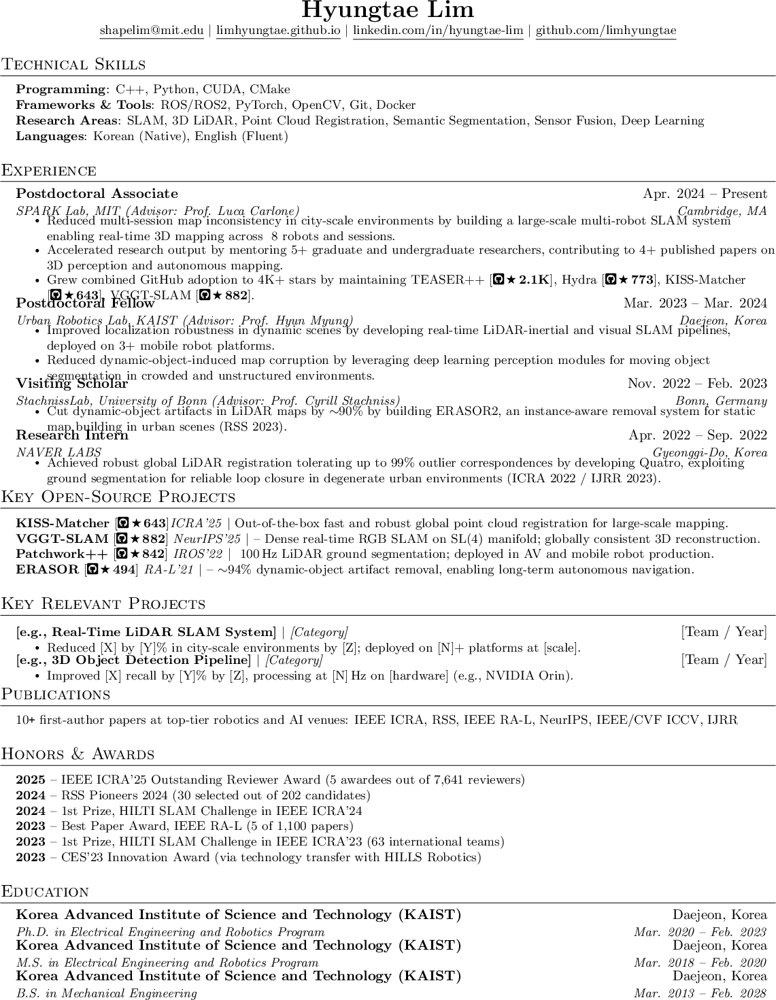
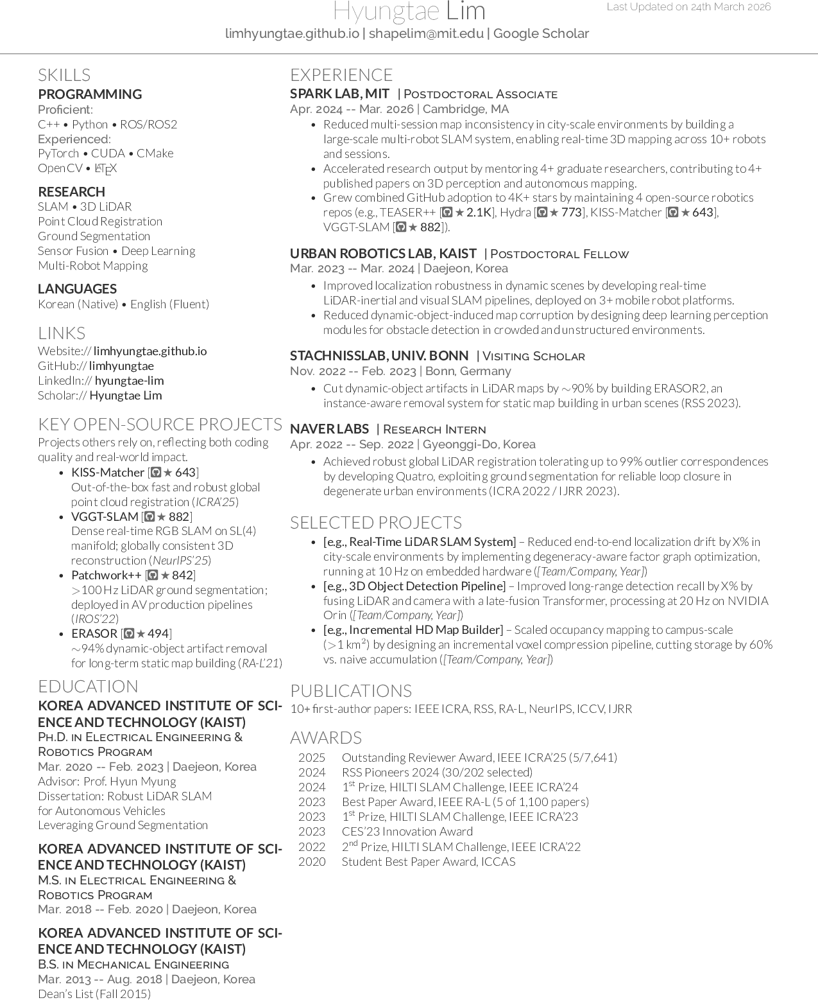
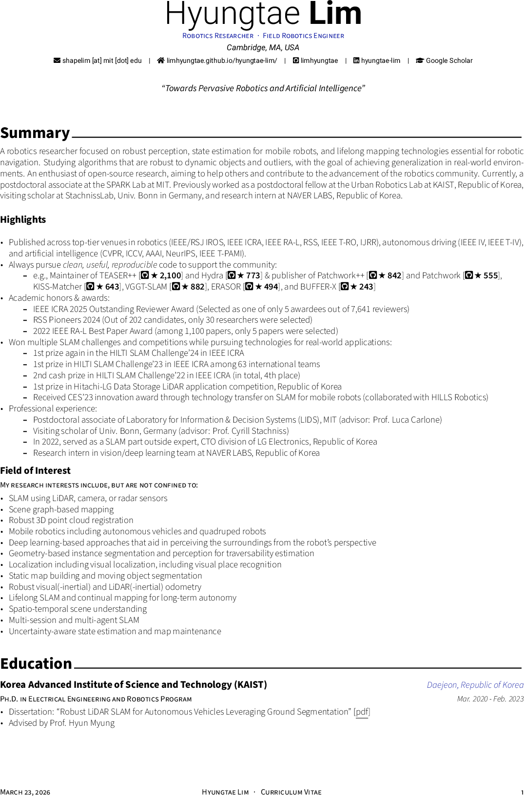

<div align="center">

<h1>Awesome Ph.D. CV Templates</h1>

<p><strong><em>LaTeX CV/resume templates for PhD students and researchers <br>—from ATS-optimized industry resumes to full academic CVs.</em></strong></p>

<table>
  <tr>
    <td align="center"><b>Jake's Format</b><br><sub>Industry / ATS-safe · pdfLaTeX</sub></td>
    <td align="center"><b>Deedy Format</b><br><sub>Industry / high-density · XeLaTeX</sub></td>
    <td align="center"><b>Awesome-CV Format</b><br><sub>Academic / full CV · XeLaTeX</sub></td>
  </tr>
  <tr>
    <td></td>
    <td></td>
    <td></td>
  </tr>
</table>

</div>

______________________________________________________________________

## :wave: Introduction

<table><tr>
<td width="180" valign="middle"></td>
<td valign="middle">

Hey! I'm [Hyungtae Lim](https://limhyungtae.github.io/hyungtae-lim/), a robotics researcher who achived my Ph.D at [KAIST](https://urobot.kaist.ac.kr/) in South Korea, and recently wrapped up a postdoc at MIT, and just landed a job at a big tech company.

While preparing my industry applications, I quickly realized there's a huge discrepancy between what a big tech company needs and what academia expects. An academic CV is long, publication-heavy, and formatted for a human reviewer who cares about your research story. An industry resume needs to survive an ATS filter first — and a lot of the LaTeX tricks we use in academic CVs (custom fonts, multi-column layouts, fancy glyphs) silently break those parsers before a recruiter ever sees your name.

This repo collects the templates I used and adapted, organized by use case, so you don't have to figure that out the hard way.

</td>
</tr></table>

______________________________________________________________________

## :thinking: Which Template Should I Use?

> **Targeting industry (including big tech)?** Use `jakes-format/` first. Big tech companies (Google, Meta, Amazon, Apple, Microsoft, etc.) route resumes through applicant tracking system (ATS) before a human ever reads them.
> Jake's format is plain pdfLaTeX with no custom fonts, no multi-column layout, and no special glyphs — all of which are common ATS failure points.
> If you prefer a denser, two-column layout and are confident the company accepts it, `deedy-format/` is a strong alternative.
>
> **Applying for a PhD program or academic position?** Use `research-cv/` — it supports multi-page layouts, full publication lists, and the detailed academic history that faculty committees expect.

| Template | Best For | Pages | Columns | Engine |
|----------|----------|-------|---------|--------|
| **Awesome-CV** | Faculty/postdoc applications, academic CV | Multi-page | 1 | XeLaTeX |
| **Jake's** | Industry SWE/internship applications | 1 | 1 | pdfLaTeX |
| **Deedy** | Experienced tech professionals | 1 | 2 | XeLaTeX |

______________________________________________________________________

## :page_facing_up: Templates

### 1. Awesome-CV Format (`research-cv/`)

A comprehensive, multi-page academic CV based on [posquit0/Awesome-CV](https://github.com/posquit0/Awesome-CV).
Best suited for **faculty applications and postdoc positions** where you need to present a full publication list, research statements, and detailed academic history.

**Includes:**
- `cv.tex` — Main CV with modular sections (education, publications, honors, etc.)
- `cv/` — Individual section files for easy editing
- `awesome-cv.cls` — The class file (XeLaTeX required)

**Key features:**
- Modular section files — edit each section independently
- Built-in support for publication lists with citation counts and GitHub stars
- Profile photo option
- Customizable accent colors
- BibTeX integration for references

**How to compile:**
```bash
cd awesome-cv-format
xelatex cv.tex
```

### 2. Jake's Format (`jakes-format/`)

A clean, single-page resume template by [Jake Gutierrez](https://github.com/sb2nov/resume).
The most popular LaTeX resume template on the internet — widely used for **industry software engineering positions** and internship applications.

**Includes:**
- `resume.tex` — Single self-contained file

**Key features:**
- **ATS-optimized** — plain pdfLaTeX output passes big tech ATS systems (no custom fonts, no multi-column layout, no special glyphs that confuse parsers)
- Single-page, single-column layout
- Clean section dividers with `\titlerule`
- Custom commands for consistent formatting (`\resumeSubheading`, `\resumeItem`, etc.)
- Easy to customize fonts (sans-serif and serif options commented out)
- Uses standard `pdflatex` — no special engine needed

**How to compile:**
```bash
cd jakes-format
pdflatex resume.tex
```

### 3. Deedy Format (`deedy-format/`)

A modern two-column resume template created by [Debarghya Das](https://github.com/deedy/Deedy-Resume). Popular among **experienced software engineers and tech professionals** who need to pack substantial experience into a single page with high information density. See also: [Deedy Resume Guide](https://www.sweresume.app/articles/deedy-resume/).

**Includes:**
- `resume.tex` — Single self-contained file

**Key features:**
- Distinctive two-column layout: narrow left (1/3) for education/skills, wide right (2/3) for experience/projects
- High information density while maintaining readability
- Clean typography with clear visual hierarchy
- `\runsubsection` and `\descript` commands for consistent entry formatting
- `\tightemize` environment for compact bullet points

**Note:** This template requires the `deedy-resume.cls` class file. Download it from the [original repository](https://github.com/deedy/Deedy-Resume).

**How to compile:**
```bash
cd deedy-format
xelatex resume.tex
```

______________________________________________________________________

## :scroll: License

- Awesome-CV: [CC BY-SA 4.0](https://creativecommons.org/licenses/by-sa/4.0/) (original by Claud D. Park)
- Jake's Resume: [MIT License](https://opensource.org/licenses/MIT) (original by Jake Gutierrez, based on [sb2nov/resume](https://github.com/sb2nov/resume))
- Deedy Resume: [Apache 2.0](https://www.apache.org/licenses/LICENSE-2.0) (original by Debarghya Das)
